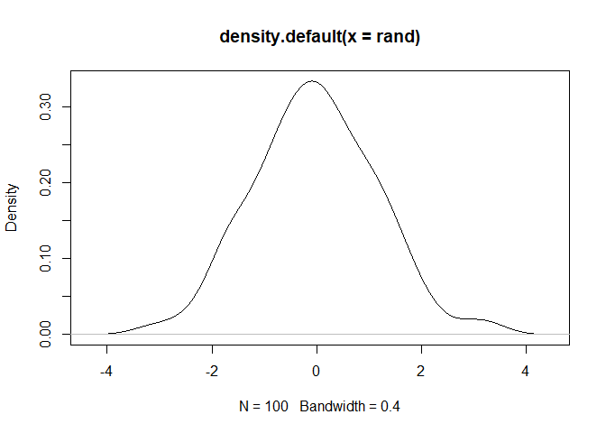
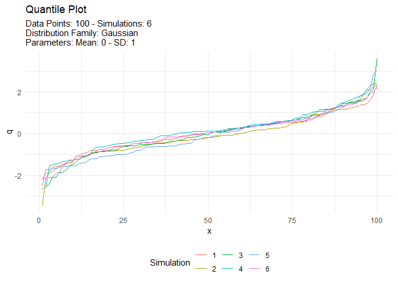
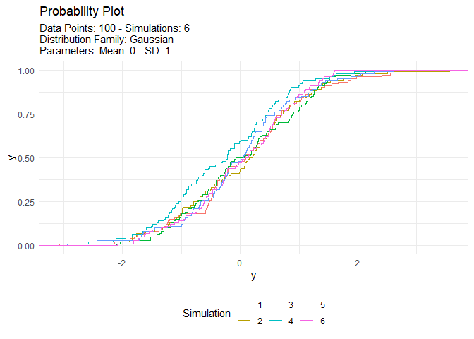
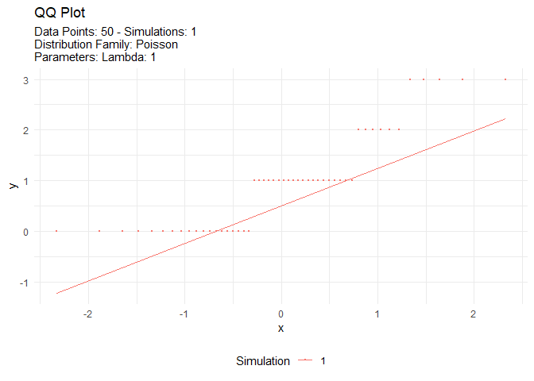
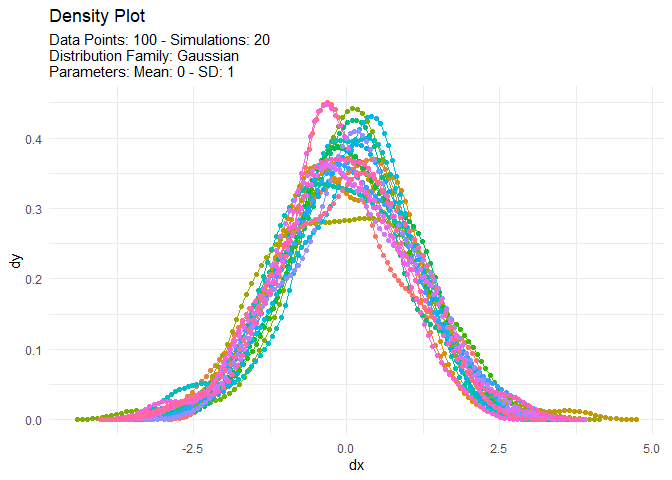
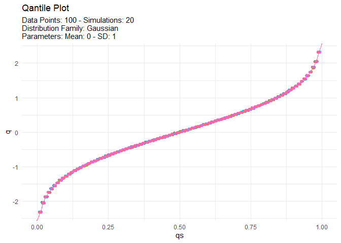
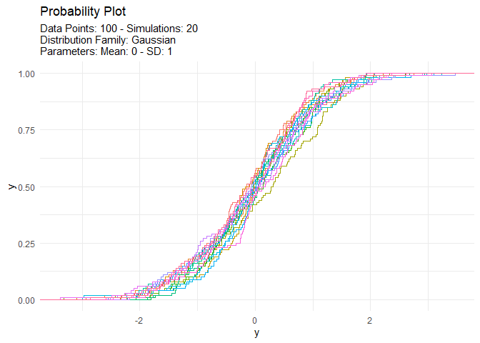
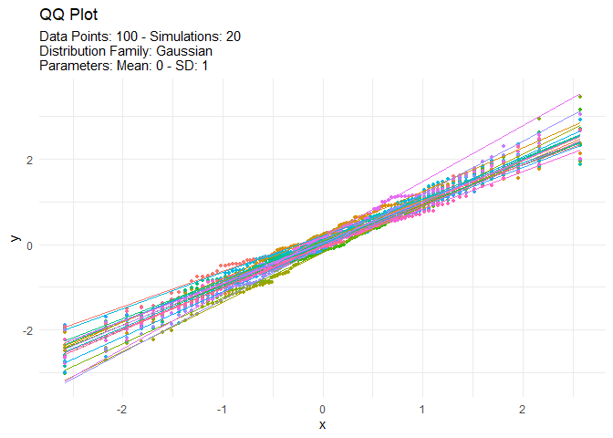

<!-- README.md is generated from README.Rmd. Please edit that file -->

# TidyDensity 

<!-- badges: start -->

[](https://cran.r-project.org/package=TidyDensity)


[](https://lifecycle.r-lib.org/articles/stages.html##stable)
[](https://makeapullrequest.com)
<!-- badges: end -->

The goal of `{TidyDensity}` is to make working with random numbers from
different distributions easy. All `tidy_` distribution functions provide
the following components:

- \[`r_`\]
- \[`d_`\]
- \[`q_`\]
- \[`p_`\]

## Installation

You can install the released version of `{TidyDensity}` from
[CRAN](https://CRAN.R-project.org) with:

``` r
install.packages("TidyDensity")
```

And the development version from [GitHub](https://github.com/) with:

``` r
# install.packages("devtools")
devtools::install_github("spsanderson/TidyDensity")
```

## Example

This is a basic example which shows you how to solve a common problem:

``` r
library(TidyDensity)
library(dplyr)
library(ggplot2)

tidy_normal()
#> # A tibble: 50 × 7
#>    sim_number     x      y    dx       dy      p      q
#>    <fct>      <int>  <dbl> <dbl>    <dbl>  <dbl>  <dbl>
#>  1 1              1  0.261 -3.68 0.000208 0.603   0.261
#>  2 1              2  0.491 -3.53 0.000571 0.688   0.491
#>  3 1              3  0.220 -3.37 0.00139  0.587   0.220
#>  4 1              4 -0.801 -3.21 0.00303  0.212  -0.801
#>  5 1              5  0.732 -3.06 0.00591  0.768   0.732
#>  6 1              6 -1.87  -2.90 0.0104   0.0308 -1.87 
#>  7 1              7 -0.898 -2.74 0.0168   0.185  -0.898
#>  8 1              8  0.157 -2.59 0.0252   0.562   0.157
#>  9 1              9 -1.06  -2.43 0.0359   0.145  -1.06 
#> 10 1             10  0.411 -2.27 0.0495   0.660   0.411
#> # ℹ 40 more rows
```

An example plot of the `tidy_normal` data.

``` r
tn <- tidy_normal(.n = 100, .num_sims = 6)

tidy_autoplot(tn, .plot_type = "density")
```



``` r
tidy_autoplot(tn, .plot_type = "quantile")
```



``` r
tidy_autoplot(tn, .plot_type = "probability")
```



``` r
tidy_autoplot(tn, .plot_type = "qq")
```



We can also take a look at the plots when the number of simulations is
greater than nine. This will automatically turn off the legend as it
will become too noisy.

``` r
tn <- tidy_normal(.n = 100, .num_sims = 20)

tidy_autoplot(tn, .plot_type = "density")
```



``` r
tidy_autoplot(tn, .plot_type = "quantile")
```



``` r
tidy_autoplot(tn, .plot_type = "probability")
```



``` r
tidy_autoplot(tn, .plot_type = "qq")
```


