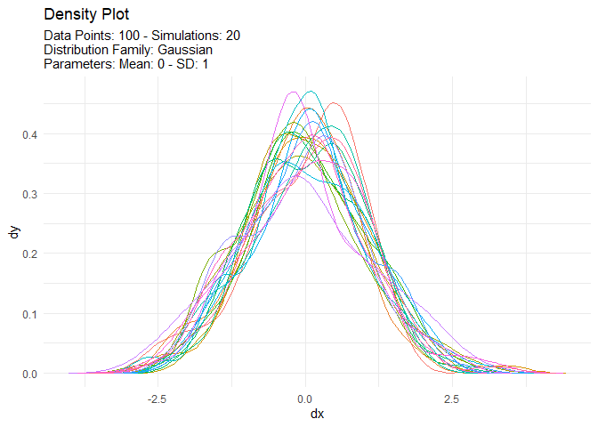

<!-- README.md is generated from README.Rmd. Please edit that file -->

# TidyDensity 

<!-- badges: start -->

[](https://cran.r-project.org/package=TidyDensity)


[](https://lifecycle.r-lib.org/articles/stages.html##experimental)
[](https://makeapullrequest.com)
<!-- badges: end -->

The goal of `{TidyDensity}` is to make working with random numbers from
different distributions easy. All `tidy_` distribution functions provide
the following components:

-   \[`r_`\]
-   \[`d_`\]
-   \[`q_`\]
-   \[`p_`\]

## Installation

You can install the released version of `{TidyDensity}` from
[CRAN](https://CRAN.R-project.org) with:

``` r
install.packages("TidyDensity")
```

And the development version from [GitHub](https://github.com/) with:

``` r
# install.packages("devtools")
devtools::install_github("spsanderson/TidyDensity")
```

## Example

This is a basic example which shows you how to solve a common problem:

``` r
library(TidyDensity)
library(dplyr)
library(ggplot2)

tidy_normal()
#> # A tibble: 50 x 7
#>    sim_number     x      y    dx       dy         p        q
#>    <fct>      <int>  <dbl> <dbl>    <dbl>     <dbl>    <dbl>
#>  1 1              1  1.24  -3.56 0.000249 0         -Inf    
#>  2 1              2  0.524 -3.41 0.000750 0           -2.05 
#>  3 1              3 -0.281 -3.27 0.00196  0           -1.74 
#>  4 1              4 -0.496 -3.12 0.00448  0           -1.54 
#>  5 1              5 -0.401 -2.97 0.00896  0           -1.39 
#>  6 1              6  0.424 -2.83 0.0158   0           -1.27 
#>  7 1              7  0.436 -2.68 0.0249   0           -1.16 
#>  8 1              8  0.862 -2.54 0.0351   4.18e-284   -1.07 
#>  9 1              9  0.861 -2.39 0.0451   1.11e-253   -0.981
#> 10 1             10  0.954 -2.24 0.0532   5.45e-225   -0.901
#> # ... with 40 more rows
```

An example plot of the `tidy_normal` data.

``` r
tn <- tidy_normal(.n = 100, .num_sims = 6)

tidy_autoplot(tn, .plot_type = "density")
```


``` r
tidy_autoplot(tn, .plot_type = "quantile")
```


``` r
tidy_autoplot(tn, .plot_type = "probability")
```


``` r
tidy_autoplot(tn, .plot_type = "qq")
```


We can also take a look at the plots when the number of simulations is
greater than nine. This will automatically turn off the legend as it
will become too noisy.

``` r
tn <- tidy_normal(.n = 100, .num_sims = 20)

tidy_autoplot(tn, .plot_type = "density")
```



``` r
tidy_autoplot(tn, .plot_type = "quantile")
```


``` r
tidy_autoplot(tn, .plot_type = "probability")
```


``` r
tidy_autoplot(tn, .plot_type = "qq")
```


