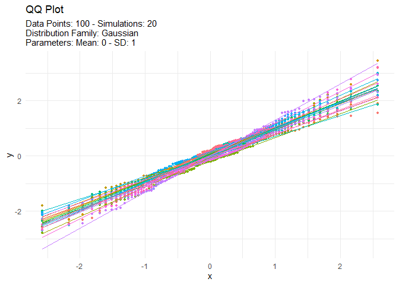

<!-- README.md is generated from README.Rmd. Please edit that file -->

# TidyDensity 

<!-- badges: start -->

[](https://cran.r-project.org/package=TidyDensity)


[](https://lifecycle.r-lib.org/articles/stages.html##stable)
[](https://makeapullrequest.com)
<!-- badges: end -->

The goal of `{TidyDensity}` is to make working with random numbers from
different distributions easy. All `tidy_` distribution functions provide
the following components:

-   \[`r_`\]
-   \[`d_`\]
-   \[`q_`\]
-   \[`p_`\]

## Installation

You can install the released version of `{TidyDensity}` from
[CRAN](https://CRAN.R-project.org) with:

``` r
install.packages("TidyDensity")
```

And the development version from [GitHub](https://github.com/) with:

``` r
# install.packages("devtools")
devtools::install_github("spsanderson/TidyDensity")
```

## Example

This is a basic example which shows you how to solve a common problem:

``` r
library(TidyDensity)
library(dplyr)
library(ggplot2)

tidy_normal()
#> # A tibble: 50 × 7
#>    sim_number     x       y    dx       dy     p      q
#>    <fct>      <int>   <dbl> <dbl>    <dbl> <dbl>  <dbl>
#>  1 1              1 -1.01   -4.27 0.000206 0.5   -0.341
#>  2 1              2 -0.725  -4.11 0.000584 0.508 -0.200
#>  3 1              3 -0.809  -3.95 0.00144  0.516 -0.241
#>  4 1              4  1.24   -3.78 0.00310  0.524  0.812
#>  5 1              5  1.38   -3.62 0.00582  0.533  0.901
#>  6 1              6  0.855  -3.46 0.00953  0.541  0.578
#>  7 1              7  2.02   -3.30 0.0136   0.549  1.54 
#>  8 1              8  1.66   -3.14 0.0170   0.557  1.12 
#>  9 1              9 -0.704  -2.97 0.0187   0.565 -0.190
#> 10 1             10 -0.0670 -2.81 0.0185   0.573  0.112
#> # … with 40 more rows
#> # ℹ Use `print(n = ...)` to see more rows
```

An example plot of the `tidy_normal` data.

``` r
tn <- tidy_normal(.n = 100, .num_sims = 6)

tidy_autoplot(tn, .plot_type = "density")
```


``` r
tidy_autoplot(tn, .plot_type = "quantile")
```


``` r
tidy_autoplot(tn, .plot_type = "probability")
```


``` r
tidy_autoplot(tn, .plot_type = "qq")
```


We can also take a look at the plots when the number of simulations is
greater than nine. This will automatically turn off the legend as it
will become too noisy.

``` r
tn <- tidy_normal(.n = 100, .num_sims = 20)

tidy_autoplot(tn, .plot_type = "density")
```


``` r
tidy_autoplot(tn, .plot_type = "quantile")
```


``` r
tidy_autoplot(tn, .plot_type = "probability")
```


``` r
tidy_autoplot(tn, .plot_type = "qq")
```


