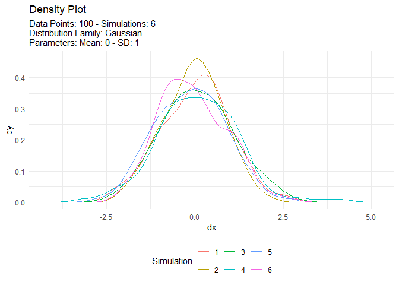

<!-- README.md is generated from README.Rmd. Please edit that file -->

# TidyDensity

<!-- badges: start -->
<!-- badges: end -->

The goal of TidyDensity is to …

## Installation

You can install the development version of TidyDensity from
[GitHub](https://github.com/) with:

``` r
# install.packages("devtools")
devtools::install_github("spsanderson/TidyDensity")
```

## Example

This is a basic example which shows you how to solve a common problem:

``` r
library(TidyDensity)
## basic example code
```

What is special about using `README.Rmd` instead of just `README.md`?
You can include R chunks like so:

``` r
rand <- rnorm(100)
rand
#>   [1] -1.078521797 -1.370724426 -0.748654279  0.174024667  0.774463336
#>   [6] -0.010168086 -0.459938870 -0.808099824 -0.855023881  0.077827136
#>  [11]  1.095847667  1.921344351  1.141005107 -0.479744761  0.812086506
#>  [16] -0.591540997 -0.764382106 -1.728709295  0.646425082  1.319772109
#>  [21]  1.243231040 -0.723585924  0.816550248 -0.134567028 -1.801376947
#>  [26]  0.567037841 -1.022186005 -0.894755385  0.290636751 -0.059829286
#>  [31] -1.062107465 -1.080158522 -0.916792447  0.331755198  0.812153319
#>  [36] -0.520801870  0.216547089  0.746199782  0.347071062 -0.126987465
#>  [41]  0.909119194 -0.405680363  0.834243117 -0.239982006 -1.925678082
#>  [46] -0.232264532 -0.212492594 -0.001754325  0.179960631  0.141562926
#>  [51]  0.474481435  0.757495203  0.726137353 -0.195018404  0.165664008
#>  [56]  2.010882434 -0.439788308 -0.892276532 -0.177273078 -0.213038598
#>  [61] -0.428773857 -0.723279250  0.689629786  0.619145734 -1.081910313
#>  [66]  0.899336838 -1.586976113  0.861037512  1.001865598 -1.161356940
#>  [71] -1.068135672  0.686549307 -0.074411301 -2.555174124 -0.426264603
#>  [76] -1.231657263 -0.408797256 -0.078141460  0.710391650 -1.183273291
#>  [81]  0.327416012  0.204930031  1.167025981 -0.514915456 -1.675229641
#>  [86] -0.212498091 -0.153385092 -1.351532260  0.848389852  0.165647195
#>  [91] -1.534539089  0.178333113 -0.241560256  0.669682580  0.275014454
#>  [96] -1.320368516  0.630935444  0.413098458  1.016453666  0.776901264
```

You’ll still need to render `README.Rmd` regularly, to keep `README.md`
up-to-date. `devtools::build_readme()` is handy for this. You could also
use GitHub Actions to re-render `README.Rmd` every time you push. An
example workflow can be found here:
<https://github.com/r-lib/actions/tree/v1/examples>.

You can also embed plots, for example:



In that case, don’t forget to commit and push the resulting figure
files, so they display on GitHub and CRAN.
