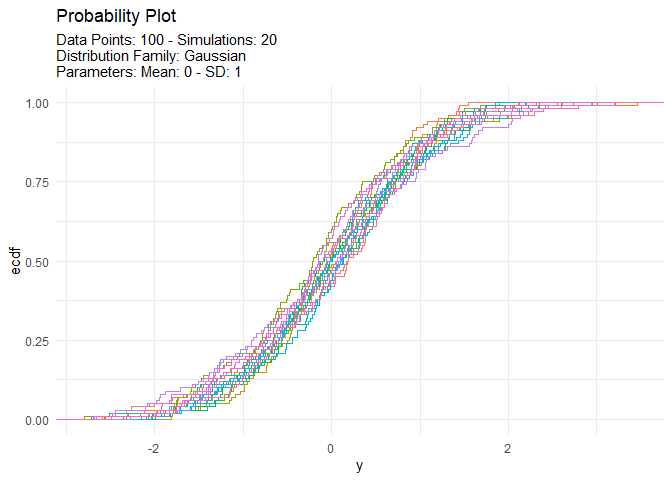

<!-- README.md is generated from README.Rmd. Please edit that file -->

# TidyDensity 

<!-- badges: start -->

[](https://cran.r-project.org/package=TidyDensity)


[](https://lifecycle.r-lib.org/articles/stages.html##stable)
[](https://makeapullrequest.com)
<!-- badges: end -->

The goal of `{TidyDensity}` is to make working with random numbers from
different distributions easy. All `tidy_` distribution functions provide
the following components:

- \[`r_`\]
- \[`d_`\]
- \[`q_`\]
- \[`p_`\]

## Installation

You can install the released version of `{TidyDensity}` from
[CRAN](https://CRAN.R-project.org) with:

``` r
install.packages("TidyDensity")
```

And the development version from [GitHub](https://github.com/) with:

``` r
# install.packages("devtools")
devtools::install_github("spsanderson/TidyDensity")
```

## Example

This is a basic example which shows you how to solve a common problem:

``` r
library(TidyDensity)
library(dplyr)
library(ggplot2)

tidy_normal()
#> # A tibble: 50 × 7
#>    sim_number     x       y    dx       dy     p       q
#>    <fct>      <int>   <dbl> <dbl>    <dbl> <dbl>   <dbl>
#>  1 1              1  0.991  -3.18 0.000487 0.839  0.991 
#>  2 1              2 -0.163  -3.05 0.00163  0.435 -0.163 
#>  3 1              3  2.19   -2.92 0.00454  0.986  2.19  
#>  4 1              4 -0.226  -2.78 0.0106   0.411 -0.226 
#>  5 1              5 -1.07   -2.65 0.0208   0.141 -1.07  
#>  6 1              6 -0.708  -2.52 0.0345   0.239 -0.708 
#>  7 1              7  0.343  -2.39 0.0488   0.634  0.343 
#>  8 1              8  0.264  -2.26 0.0600   0.604  0.264 
#>  9 1              9 -0.0531 -2.13 0.0667   0.479 -0.0531
#> 10 1             10  0.444  -2.00 0.0705   0.671  0.444 
#> # ℹ 40 more rows
```

An example plot of the `tidy_normal` data.

``` r
tn <- tidy_normal(.n = 100, .num_sims = 6)

tidy_autoplot(tn, .plot_type = "density")
```


``` r
tidy_autoplot(tn, .plot_type = "quantile")
```


``` r
tidy_autoplot(tn, .plot_type = "probability")
```


``` r
tidy_autoplot(tn, .plot_type = "qq")
```


We can also take a look at the plots when the number of simulations is
greater than nine. This will automatically turn off the legend as it
will become too noisy.

``` r
tn <- tidy_normal(.n = 100, .num_sims = 20)

tidy_autoplot(tn, .plot_type = "density")
```


``` r
tidy_autoplot(tn, .plot_type = "quantile")
```


``` r
tidy_autoplot(tn, .plot_type = "probability")
```



``` r
tidy_autoplot(tn, .plot_type = "qq")
```


