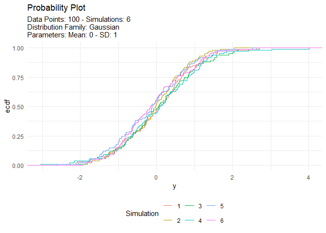

<!-- README.md is generated from README.Rmd. Please edit that file -->

# TidyDensity 

<!-- badges: start -->

[](https://cran.r-project.org/package=TidyDensity)


[](https://lifecycle.r-lib.org/articles/stages.html##stable)
[](https://makeapullrequest.com)
<!-- badges: end -->

The goal of `{TidyDensity}` is to make working with random numbers from
different distributions easy. All `tidy_` distribution functions provide
the following components:

- \[`r_`\]
- \[`d_`\]
- \[`q_`\]
- \[`p_`\]

## Installation

You can install the released version of `{TidyDensity}` from
[CRAN](https://CRAN.R-project.org) with:

``` r
install.packages("TidyDensity")
```

And the development version from [GitHub](https://github.com/) with:

``` r
# install.packages("devtools")
devtools::install_github("spsanderson/TidyDensity")
```

## Example

This is a basic example which shows you how to solve a common problem:

``` r
library(TidyDensity)
library(dplyr)
library(ggplot2)

tidy_normal()
#> # A tibble: 50 × 7
#>    sim_number     x       y    dx       dy      p       q
#>    <fct>      <int>   <dbl> <dbl>    <dbl>  <dbl>   <dbl>
#>  1 1              1  1.54   -2.82 0.000447 0.938   1.54  
#>  2 1              2  0.644  -2.69 0.00139  0.740   0.644 
#>  3 1              3 -1.30   -2.55 0.00376  0.0968 -1.30  
#>  4 1              4 -0.485  -2.42 0.00898  0.314  -0.485 
#>  5 1              5 -1.30   -2.28 0.0189   0.0974 -1.30  
#>  6 1              6  0.155  -2.15 0.0352   0.562   0.155 
#>  7 1              7 -1.76   -2.01 0.0586   0.0390 -1.76  
#>  8 1              8  0.562  -1.88 0.0879   0.713   0.562 
#>  9 1              9 -1.69   -1.74 0.120    0.0455 -1.69  
#> 10 1             10 -0.0214 -1.61 0.149    0.491  -0.0214
#> # ℹ 40 more rows
```

An example plot of the `tidy_normal` data.

``` r
tn <- tidy_normal(.n = 100, .num_sims = 6)

tidy_autoplot(tn, .plot_type = "density")
```


``` r
tidy_autoplot(tn, .plot_type = "quantile")
```


``` r
tidy_autoplot(tn, .plot_type = "probability")
```



``` r
tidy_autoplot(tn, .plot_type = "qq")
```


We can also take a look at the plots when the number of simulations is
greater than nine. This will automatically turn off the legend as it
will become too noisy.

``` r
tn <- tidy_normal(.n = 100, .num_sims = 20)

tidy_autoplot(tn, .plot_type = "density")
```


``` r
tidy_autoplot(tn, .plot_type = "quantile")
```


``` r
tidy_autoplot(tn, .plot_type = "probability")
```


``` r
tidy_autoplot(tn, .plot_type = "qq")
```


