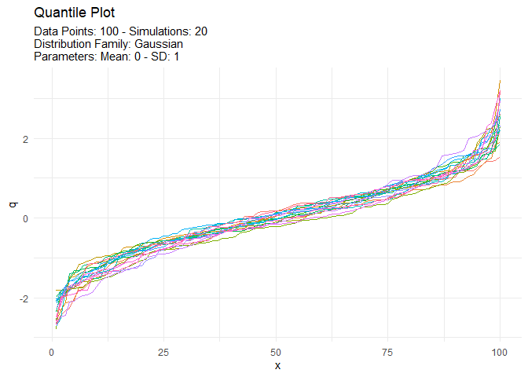

<!-- README.md is generated from README.Rmd. Please edit that file -->

# TidyDensity 

<!-- badges: start -->

[](https://cran.r-project.org/package=TidyDensity)


[](https://lifecycle.r-lib.org/articles/stages.html##stable)
[](https://makeapullrequest.com)
<!-- badges: end -->

The goal of `{TidyDensity}` is to make working with random numbers from
different distributions easy. All `tidy_` distribution functions provide
the following components:

- \[`r_`\]
- \[`d_`\]
- \[`q_`\]
- \[`p_`\]

## Installation

You can install the released version of `{TidyDensity}` from
[CRAN](https://CRAN.R-project.org) with:

``` r
install.packages("TidyDensity")
```

And the development version from [GitHub](https://github.com/) with:

``` r
# install.packages("devtools")
devtools::install_github("spsanderson/TidyDensity")
```

## Example

This is a basic example which shows you how to solve a common problem:

``` r
library(TidyDensity)
library(dplyr)
library(ggplot2)

tidy_normal()
#> # A tibble: 50 × 7
#>    sim_number     x      y    dx       dy     p      q
#>    <fct>      <int>  <dbl> <dbl>    <dbl> <dbl>  <dbl>
#>  1 1              1  0.227 -2.97 0.000238 0.590  0.227
#>  2 1              2  1.12  -2.84 0.000640 0.869  1.12 
#>  3 1              3  1.26  -2.71 0.00153  0.897  1.26 
#>  4 1              4  0.204 -2.58 0.00326  0.581  0.204
#>  5 1              5  1.04  -2.44 0.00620  0.852  1.04 
#>  6 1              6 -0.180 -2.31 0.0106   0.429 -0.180
#>  7 1              7  0.299 -2.18 0.0167   0.618  0.299
#>  8 1              8  1.73  -2.04 0.0243   0.959  1.73 
#>  9 1              9 -0.770 -1.91 0.0338   0.221 -0.770
#> 10 1             10  0.385 -1.78 0.0463   0.650  0.385
#> # ℹ 40 more rows
```

An example plot of the `tidy_normal` data.

``` r
tn <- tidy_normal(.n = 100, .num_sims = 6)

tidy_autoplot(tn, .plot_type = "density")
```


``` r
tidy_autoplot(tn, .plot_type = "quantile")
```


``` r
tidy_autoplot(tn, .plot_type = "probability")
```


``` r
tidy_autoplot(tn, .plot_type = "qq")
```


We can also take a look at the plots when the number of simulations is
greater than nine. This will automatically turn off the legend as it
will become too noisy.

``` r
tn <- tidy_normal(.n = 100, .num_sims = 20)

tidy_autoplot(tn, .plot_type = "density")
```


``` r
tidy_autoplot(tn, .plot_type = "quantile")
```



``` r
tidy_autoplot(tn, .plot_type = "probability")
```


``` r
tidy_autoplot(tn, .plot_type = "qq")
```


