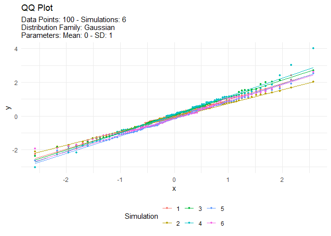

<!-- README.md is generated from README.Rmd. Please edit that file -->

# TidyDensity 

<!-- badges: start -->

[](https://cran.r-project.org/package=TidyDensity)


[](https://lifecycle.r-lib.org/articles/stages.html##stable)
[](https://makeapullrequest.com)
<!-- badges: end -->

The goal of `{TidyDensity}` is to make working with random numbers from
different distributions easy. All `tidy_` distribution functions provide
the following components:

-   \[`r_`\]
-   \[`d_`\]
-   \[`q_`\]
-   \[`p_`\]

## Installation

You can install the released version of `{TidyDensity}` from
[CRAN](https://CRAN.R-project.org) with:

``` r
install.packages("TidyDensity")
```

And the development version from [GitHub](https://github.com/) with:

``` r
# install.packages("devtools")
devtools::install_github("spsanderson/TidyDensity")
```

## Example

This is a basic example which shows you how to solve a common problem:

``` r
library(TidyDensity)
library(dplyr)
library(ggplot2)

tidy_normal()
#> # A tibble: 50 × 7
#>    sim_number     x       y    dx       dy     p       q
#>    <fct>      <int>   <dbl> <dbl>    <dbl> <dbl>   <dbl>
#>  1 1              1  1.02   -3.45 0.000231 0.5    0.334 
#>  2 1              2  0.807  -3.29 0.000697 0.508  0.229 
#>  3 1              3  0.558  -3.14 0.00181  0.516  0.108 
#>  4 1              4 -0.113  -2.98 0.00401  0.524 -0.216 
#>  5 1              5  0.519  -2.83 0.00764  0.533  0.0890
#>  6 1              6  0.615  -2.68 0.0126   0.541  0.136 
#>  7 1              7 -1.01   -2.52 0.0181   0.549 -0.698 
#>  8 1              8  0.180  -2.37 0.0233   0.557 -0.0738
#>  9 1              9  0.0577 -2.21 0.0285   0.565 -0.133 
#> 10 1             10 -1.09   -2.06 0.0354   0.573 -0.747 
#> # … with 40 more rows
```

An example plot of the `tidy_normal` data.

``` r
tn <- tidy_normal(.n = 100, .num_sims = 6)

tidy_autoplot(tn, .plot_type = "density")
```


``` r
tidy_autoplot(tn, .plot_type = "quantile")
```


``` r
tidy_autoplot(tn, .plot_type = "probability")
```


``` r
tidy_autoplot(tn, .plot_type = "qq")
```



We can also take a look at the plots when the number of simulations is
greater than nine. This will automatically turn off the legend as it
will become too noisy.

``` r
tn <- tidy_normal(.n = 100, .num_sims = 20)

tidy_autoplot(tn, .plot_type = "density")
```


``` r
tidy_autoplot(tn, .plot_type = "quantile")
```


``` r
tidy_autoplot(tn, .plot_type = "probability")
```


``` r
tidy_autoplot(tn, .plot_type = "qq")
```


