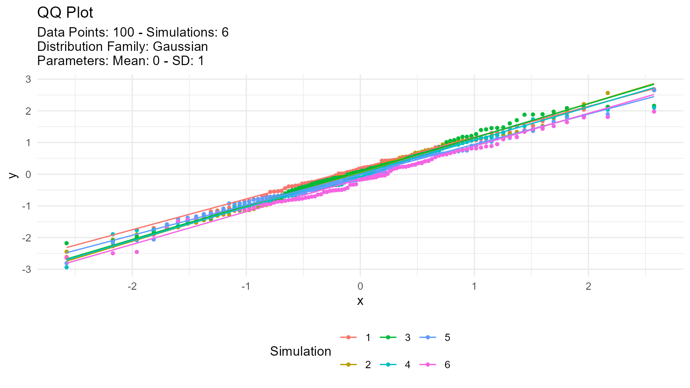
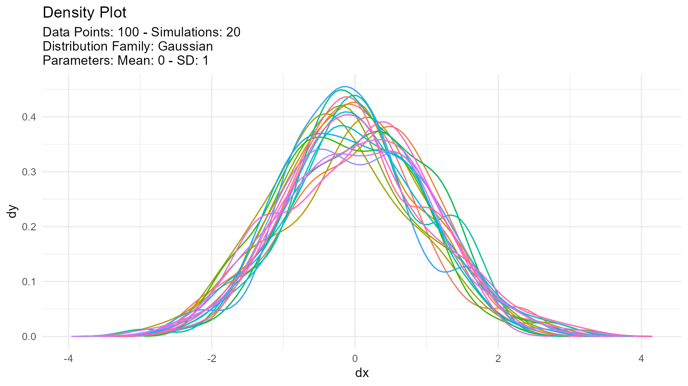
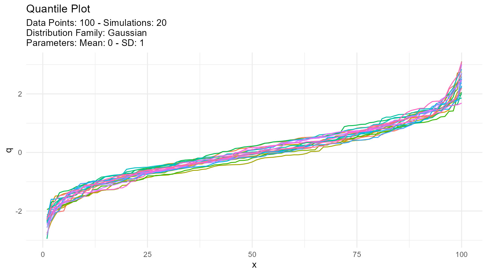
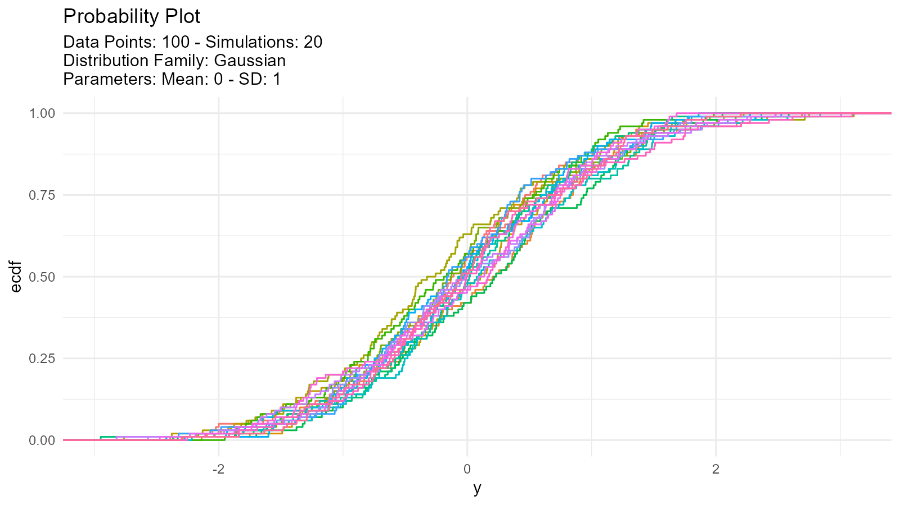

# Getting Started with TidyDensity

``` r
library(TidyDensity)
```

## Example

This is a basic example which shows you how easy it is to generate data
with [TidyDensity](https://github.com/spsanderson/TidyDensity):

``` r
library(TidyDensity)
library(dplyr)
library(ggplot2)

tidy_normal()
#> # A tibble: 50 × 7
#>    sim_number     x        y    dx       dy       p        q
#>    <fct>      <int>    <dbl> <dbl>    <dbl>   <dbl>    <dbl>
#>  1 1              1 -1.40    -3.47 0.000261 0.0808  -1.40   
#>  2 1              2  0.255   -3.32 0.000873 0.601    0.255  
#>  3 1              3 -2.44    -3.17 0.00245  0.00740 -2.44   
#>  4 1              4 -0.00557 -3.02 0.00579  0.498   -0.00557
#>  5 1              5  0.622   -2.88 0.0117   0.733    0.622  
#>  6 1              6  1.15    -2.73 0.0209   0.875    1.15   
#>  7 1              7 -1.82    -2.58 0.0337   0.0342  -1.82   
#>  8 1              8 -0.247   -2.43 0.0512   0.402   -0.247  
#>  9 1              9 -0.244   -2.28 0.0741   0.404   -0.244  
#> 10 1             10 -0.283   -2.14 0.102    0.389   -0.283  
#> # ℹ 40 more rows
```

An example plot of the `tidy_normal` data.

``` r
tn <- tidy_normal(.n = 100, .num_sims = 6)

tidy_autoplot(tn, .plot_type = "density")
```


``` r
tidy_autoplot(tn, .plot_type = "quantile")
```


``` r
tidy_autoplot(tn, .plot_type = "probability")
```


``` r
tidy_autoplot(tn, .plot_type = "qq")
```



We can also take a look at the plots when the number of simulations is
greater than nine. This will automatically turn off the legend as it
will become too noisy.

``` r
tn <- tidy_normal(.n = 100, .num_sims = 20)

tidy_autoplot(tn, .plot_type = "density")
```



``` r
tidy_autoplot(tn, .plot_type = "quantile")
```



``` r
tidy_autoplot(tn, .plot_type = "probability")
```



``` r
tidy_autoplot(tn, .plot_type = "qq")
```


